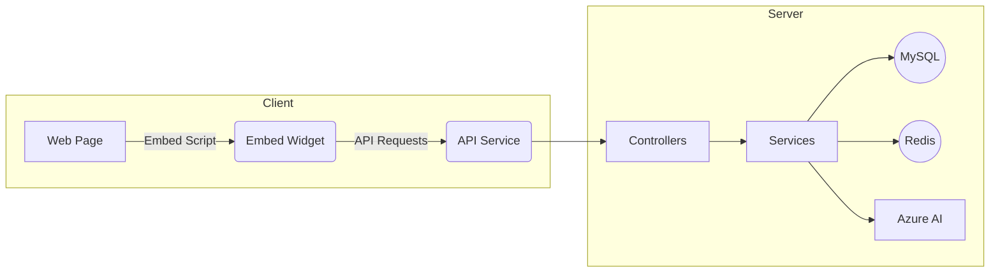
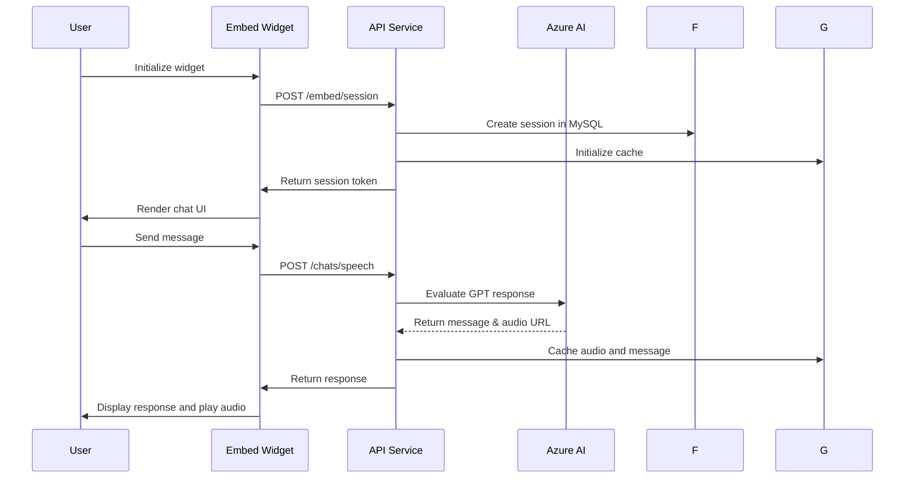

# CriaEmbed Architecture Document

## 1. Introduction
This document describes the high-level architecture, components, and data flows of the CriaEmbed project. CriaEmbed provides a backend API and embeddable frontend components for AI-powered chat experiences, leveraging TypeScript, Node.js, React, MySQL, Redis, and Azure services.

## 2. Goals and Requirements
- Expose a RESTful API for chat management and embedding
- Support inline and popup embedding of chat widgets
- Provide configurable prompts, sessions, and speech synthesis
- Integrate with Azure AI services and store state in SQL and Redis
- Offer a single-page React application for standalone use and embed snippets
- Deploy via Docker for consistency across environments

## 3. System Overview
At a high level, the system consists of two main applications:

1. **API Service** (`/api`)
   - Written in Node.js with TypeScript
   - Uses TSOA to generate Swagger/OpenAPI definitions
   - Handles chat operations, session management, and integrations
   - Connects to MySQL (persistent data) and Redis (caching)
   - Integrates with Azure AI services for chat and speech
   - Provides embed-specific controllers for inline and popup code

2. **Client App** (`/app`)
   - Built with React and Vite
   - Renders the main chat UI for end users
   - Provides embeddable JavaScript snippets (`embed.js`) for third-party sites
   - Styles and assets managed under `public/` and `src/`

External dependencies:
- Azure Cognitive Services (chat, speech)
- Docker for containerization
- PNPM for package management

## 4. High-Level Architecture Diagram

## 5. Components Breakdown

### 5.1 API Service (`/api`)
- **Entry Point**: `src/server.ts` sets up Express, middleware (CORS, JSON), and mounts routes.
- **Routing & Controllers**: Defined under `src/controllers/` with subfolders for chats, embed, integrations, and manage operations.
- **Services**: Business logic in `src/services/`, e.g., `EmbedService.ts`, `SpeechService.ts`.
- **Database Access**:
  - MySQL: `src/database/mysql/mysql.ts` and controllers for persistent storage (`BotEmbed`, `InitialPrompts`).
  - Redis: `src/database/redis/redis.ts` and cache controllers (`AudioCache`, `MessageCache`).
- **Integration**: Azure integration in `AzureService.ts` and channel handlers for email/Teams.
- **Build & CI**:
  - `build.sh`, Dockerfile, and `entrypoint.sh` for Docker container builds.
  - TSOA generates `build/routes.ts` and `swagger.json`.

### 5.2 Client Application (`/app`)
- **Entry Point**: `src/index.jsx` bootstraps React and mounts `Home.jsx`.
- **Components**: Organized under `src/home/components/`, including chat UI, headers, lists, and utility components.
- **Styling**: SCSS modules (`index.scss`) and global styles.
- **Embedding Snippets**: `public/loader.js` and inline/popup assets under `public/`.
- **Build & Deployment**: Vite config (`vite.config.js`) for development and production bundles.

## 6. Data Storage and Caching

- **MySQL**:
  - Stores embed configurations, session data, and prompts.
  - Schema defined in `assets/schema.sql`.
- **Redis**:
  - Caches chat messages, audio streams, and tracking data.
  - Controllers under `src/database/redis/controllers/`.

## 7. Sequence Flow

## 8. Deployment & Environments

- **Docker**:
  - API: uses `api/Dockerfile`, environment in `api/docker.env`
  - App: uses `app/Dockerfile`
- **Local Scripts**: `build.sh` and `entrypoint.sh` for each service.
- **Environments**: Supports development, staging, production via environment variables.

## 9. Security & Authentication

- **API Keys**: Secured via environment variables (`AZURE_KEY`, `DB_PASSWORD`).
- **CORS**: Configured in `app.ts` to restrict origins.
- **Rate Limiting**: Implement at API gateway or middleware (future enhancement).

## 10. Scalability & Reliability

- **Stateless API**: Horizontal scaling of Node.js containers.
- **Redis Caching**: Offloads frequent operations and reduces latency.
- **Database**: MySQL can be scaled via read replicas.
- **Queueing**: Introduce message queue for long-running tasks (future work).

## 11. Monitoring & Logging

- **Logs**: Standardized JSON logs via middleware.
- **Metrics**: Integrate Prometheus/Grafana.
- **Alerts**: Set up on error rates and latency.

## 12. Future Improvements

- Implement OAuth2 for user authentication
- Add WebSocket support for real-time updates
- Introduce CI/CD pipelines (GitHub Actions)
- Expand Azure integrations (speech-to-text, translation)
- Modularize embed SDK for third-party extensions

---
*Document last updated: August 11, 2025*
