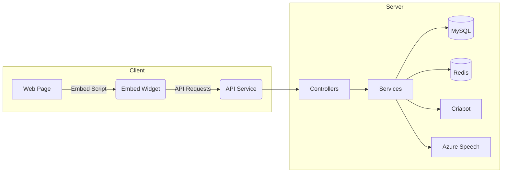
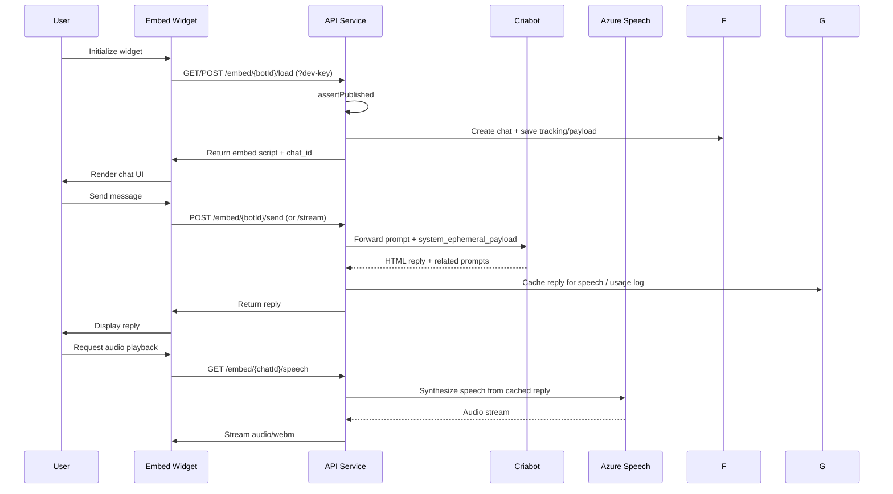

# CriaEmbed Architecture Document

## 1. Introduction

This document describes the high-level architecture, components, and data flows of the CriaEmbed project. CriaEmbed provides a backend API and embeddable frontend for AI-powered chat widgets. Chat orchestration goes through **Criabot** (which talks to Criadex/Ragflow); CriaEmbed owns widget config, sessions, publish visibility, personalization, usage logs, speech, and optional Azure Bot channels.

## 2. Goals and Requirements

- Expose a RESTful API for chat sessions and embedding
- Support inline and popup embedding of chat widgets
- Enforce publish / developer-mode visibility (fail closed when unpublished)
- Persist embed config (greeting, icon, prompts, personalization templates)
- Proxy chat send/stream to Criabot with per-session personalization
- Provide speech synthesis and optional Azure Bot Service integration
- Offer a React SPA for standalone use and embed snippets
- Deploy via Docker for consistency across environments

## 3. System Overview

Two main applications:

1. **API Service** (`/api`)
   - Node.js + TypeScript; TSOA generates OpenAPI/routes
   - Controllers: chats, embed, manage, integrations, **internal** (usage logs)
   - MySQL (bot embed config, usage logs) + Redis (sessions, message/audio cache)
   - Outbound: Criabot (chat + publish sync), Azure Speech, optional Azure Bot channels
   - Standalone Elasticsearch vector upsert/search (`criaembed` index — not Criadex/Ragflow)

2. **Client App** (`/app`)
   - React + Vite chat UI (streaming replies, reasoning panel, citations)
   - Embeddable JS snippets for third-party sites

External dependencies: Criabot, Redis, MySQL, Elasticsearch, Azure Speech (optional Azure Bot Service).

## 4. High-Level Architecture Diagram

```mermaid
flowchart LR
  subgraph Client
    A[Web Page] -->|Embed Script| B(Embed Widget)
    B -->|API Requests| C(API Service)
  end
  subgraph Server
    C --> D[Controllers]
    D --> E[Services]
    E --> F[(MySQL)]
    E --> G[(Redis)]
    E --> CB[Criabot]
    E --> S[Azure Speech]
  end
```

## 5. Components Breakdown

### 5.1 API Service (`/api`)

- **Entry Point**: `src/server.ts` / `src/app.ts` — Express, CORS, JSON, rate limits, mounts TSOA routes.
- **Controllers** (`src/controllers/`):
  - `chats/` — exists / create
  - `embed/` — load, config, send, stream, session_data, speech, popup/inline assets, vector store
  - `manage/` — insert / config get+patch / delete / diagnose
  - `integrations/` — Azure Bot webhook
  - `internal/` — `GET /internal/usage-logs` (Criabot gateway; `X-Internal-Token`)
- **Services**:
  - `EmbedService.ts` — load/session/chat; publish gate (`publish === true` or matching `developerMode` + `dev-key`); personalization → Criabot `system_ephemeral_payload`
  - `personalizationPayload.ts` — extract payload + resolve `[variableName]` templates
  - `ManageService.ts` — embed config CRUD; **bidirectional publish sync** to Criabot `/manage/publish` when `publish`/`developerMode` change (skipped when `X-Internal-Service: criabot`)
  - `SpeechService.ts`, `AzureService.ts`, `embedPrompt.ts`, `VectorStoreService.ts`
- **Database**:
  - MySQL: `BotEmbed` (includes `publish`, `developerMode`, `personalizationPayload`, `botIconUrl`, `initialPrompts`), `InitialPrompts`, `EmbedUsageLog`
  - Redis: `AudioCache`, `MessageCache`, session/tracking data
- **Config**: `EMBED_INTERNAL_TOKEN` (inbound S2S), `CRIA_BOT_SERVER_TOKEN` / `CRIA_BOT_SERVER_URL` (outbound to Criabot)

### 5.2 Client Application (`/app`)

- **Entry**: `src/index.jsx` → `Home.jsx`
- **Chat UI**: streaming bubbles, reasoning timeline (`ReasoningBlock.jsx`), citations, commands
- **Config**: `src/config.js` (API base URLs, `dev-key` support for unpublished bots)
- **Build**: Vite (`vite.config.js`); Docker via `app/Dockerfile`

## 6. Data Storage and Caching

- **MySQL** (`api/src/assets/schema.sql`): embed configurations, usage logs, prompts.
- **Redis**: chat messages, audio streams, tracking / personalization cache keyed by `chatId`.

## 7. Sequence Flow

```mermaid
sequenceDiagram
  participant U as User
  participant W as Embed Widget
  participant A as API Service
  participant CB as Criabot
  participant S as Azure Speech
  U->>W: Initialize widget
  W->>A: GET/POST /embed/{botId}/load (?dev-key)
  A->>A: assertPublished
  A->>F: Create chat + save tracking/payload
  A->>W: Return embed script + chat_id
  W->>U: Render chat UI
  U->>W: Send message
  W->>A: POST /embed/{botId}/send (or /stream)
  A->>CB: Forward prompt + system_ephemeral_payload
  CB-->>A: HTML reply + related prompts
  A->>G: Cache reply for speech / usage log
  A->>W: Return reply
  W->>U: Display reply
  U->>W: Request audio playback
  W->>A: GET /embed/{chatId}/speech
  A->>S: Synthesize speech from cached reply
  S-->>A: Audio stream
  A->>W: Stream audio/webm
```

Publish sync (MARS / manage API → Criabot): `PATCH /manage/{botId}/config` with `publish`/`developerMode` → Criabot `PATCH /bots/{bot}/manage/publish` with mapped status. Criabot→Embed pushes set `X-Internal-Service: criabot` so sync does not loop.

## 8. Deployment & Environments

- **Docker**: `api/Dockerfile`, `app/Dockerfile`; env via `.env` / compose (`EMBED_INTERNAL_TOKEN` must match Criabot's `CRIAEMBED_INTERNAL_TOKEN`).
- **Local**: `npm run dev` / `npm run test` under `/api`; Vite under `/app`.

## 9. Security & Authentication

- **X-Api-Key**: manage routes, authenticated load, vector store.
- **X-Internal-Token**: usage-log internal API.
- **Publish gate**: public embed surface returns `404` when unpublished unless `dev-key` matches `developerMode`.
- **CORS / rate limits**: configured in `app.ts`.

## 10. Scalability & Reliability

- Stateless API containers; Redis for hot session/cache data; MySQL for durable config/logs.

## 11. Monitoring & Logging

- JSON logs via middleware; `/health_check` and `/manage/_diagnose` (Criabot reachability).

## 12. Future Improvements

- OAuth2 for end-user authentication
- WebSocket channel (SSE streaming for chat is already implemented)
- Expand Azure STT / translation
- Modularize embed SDK for third-party extensions

---

_Document last updated: 2026-07-31 — publish/developerMode, personalization payload, bidirectional Criabot sync, and internal usage-log gateway reflected._
